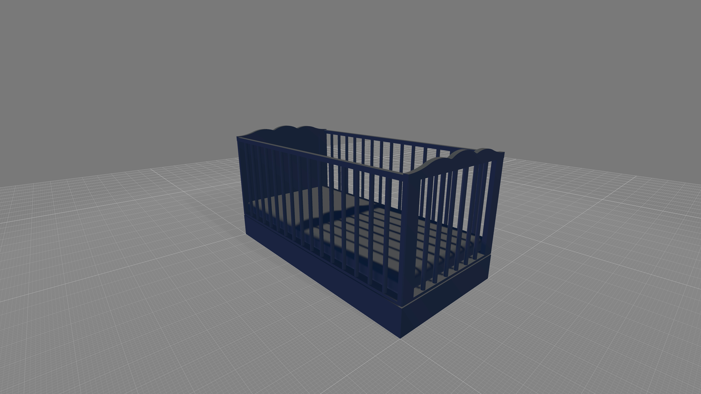

 

The "Autocradle" is a device designed to help parents with newborn babies by automating the swinging motion of a cradle and detecting crying or excessive movement using a microphone and motion sensor. The goal of the "Autocradle" is to provide some assistance to parents during the demanding and exhausting early months of parenthood by helping to soothe their babies and potentially providing some alerts for parents.

# Implementation

We have simulated our project using CoppeliaSim V-REP to test and refine the design and functionality of the "Autocradle".

# Key Features

Device provides the following features:

- 1
- 2
- 3
- 4

# Safety and reliability

The "Autocradle" has been designed with safety and reliability in mind. All components and materials used in the device have been carefully selected to meet appropriate safety standards, and the device has been thoroughly tested in simulation to ensure that it works as intended.

# Useful Links

- [Documentation](https://docs.google.com/document/d/1a7heLcFJWA4TKgQkrIBBfnVDRLf50KOp/edit)

<!-- USAGE EXAMPLES -->
## Usage

Use this space to show useful examples of how a project can be used. Additional screenshots, code examples and demos work well in this space. You may also link to more resources.

_For more examples, please refer to the [Documentation](https://example.com)_

<!-- ROADMAP -->
## Roadmap

- [x] Lorem ipsum dolor sit amet
- [ ] Donec luctus porta lobortis
    - [x] Sed sit amet facilisis ligula
    - [ ] Phasellus mollis mauris id tellus tincidunt

See the [open issues](https://github.com/othneildrew/Best-README-Template/issues) for a full list of proposed features (and known issues).

<!-- ACKNOWLEDGMENTS -->
## Acknowledgments

Use this space to list resources you find helpful and would like to give credit to. I've included a few of my favorites to kick things off!

* [Choose an Open Source License](https://choosealicense.com)
* [GitHub Emoji Cheat Sheet](https://www.webpagefx.com/tools/emoji-cheat-sheet)
* [Img Shields](https://shields.io)
* [GitHub Pages](https://pages.github.com)
* [Font Awesome](https://fontawesome.com)

(<a href="#README-top">back to top</a>)

  # Contributors ✨
<table>
  <tbody>
    <tr>
      <td align="center"><a href="https://github.com/Ephemerish"> <b>Kenneth Harold Panis</b></a> <a href="Scripts/" title="Scripting">💻</a></td>
      <td align="center"><a href="https://github.com/Ephemerish"> <b>Lloyd Burton</b></a> <a title="Tests">⚠️</a> <a title="Bug reports">🐛</a> <a href="Documents/"title="Documentation">📖</a></td> 
      <td align="center"><a href="https://github.com/Ephemerish"> <b>Lyca Lague</b></a> <a title="Tests">⚠️</a> <a title="Bug reports">🐛</a> <a href="Documents/"title="Documentation">📖</a></td>
      <td align="center"><a href="https://github.com/Ephemerish"> <b>Crisha Mae Acasio</b></a> <a  title="Code">💻</a> <a  title="Tests">⚠️</a> <a  title="Bug reports">🐛</a> <a title="Model">🗿</a></td>
    </tr>
  </tbody>
</table>